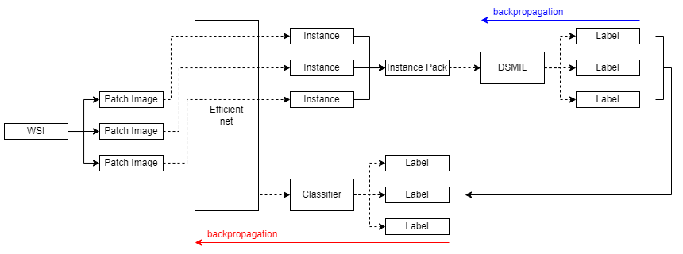
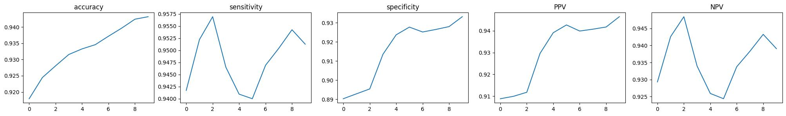
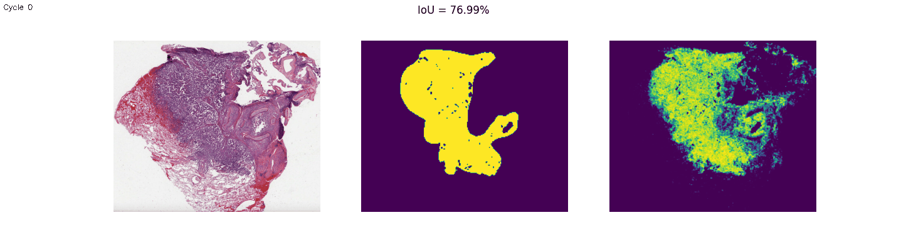

# Whole Slide Image (WSI) Lung Adenocarcinoma (LUAD) MIL Learning

   
1. Make patch image informations and save as pickle file.   
2. Train positive or negative diagnosis CNN model saved patch image information.   
3. Extract instance data and saved as pickle file.   
4. Train MIL model with instance bag data.   
5. Return to 1.   
   
## Results Example
Statistical graph. x is each cycle, total 10 cycle.
   
TCGA-49-6744-01Z-00-DX4 label mask example.   
Compare mask. (original / initial label / diagnosis label at each cycle)
   
Overlapping mask.
   
   
## Process
Make variable tsv text file about each cycle.   
```bash
python process_0_make_variable.py -n 0
```
   
Calculate patch image coordinate and size with preprocessing modules.   
```bash
python process_1_prepare_dataset.py --tsv variable_1_prepare_dataset.tsv
```
   
Import patch image and label for training efficient-net CNN model.   
Seperate classifier in model to extract instance and results label data.    
```bash
python process_2_CNN_training.py --tsv variable_2_CNN_training.tsv
```
   
Input instance bag data in MIL model. Make reference MIL label data.   
```bash
python process_3_MIL_training.py --tsv variable_3_MIL_training.tsv
```
   
Analysis MIL results and draw label map mask image.   
```bash
python process_4_analysis_results.py --tsv variable_4_analysis_results.tsv
```
   
To easliy compare each cycle's results, Merging each label map mask image to gif image file.   
```bash
python organization_analysis_results.py
```
   
Simple auto run script using upper entire process.   
```bash
auto_cycle.sh
```